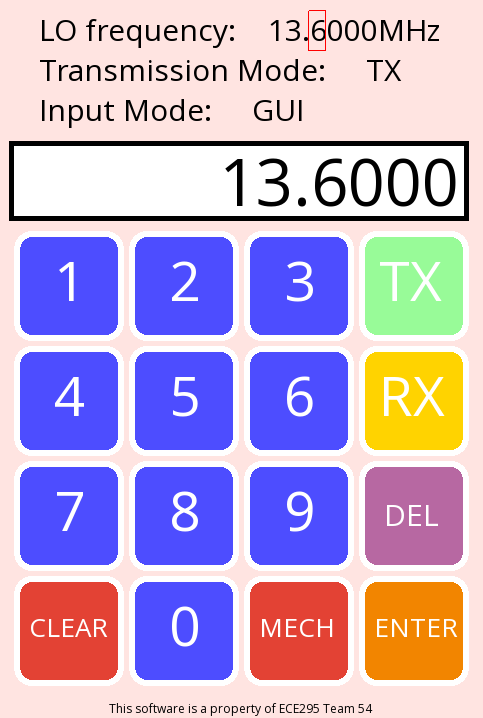
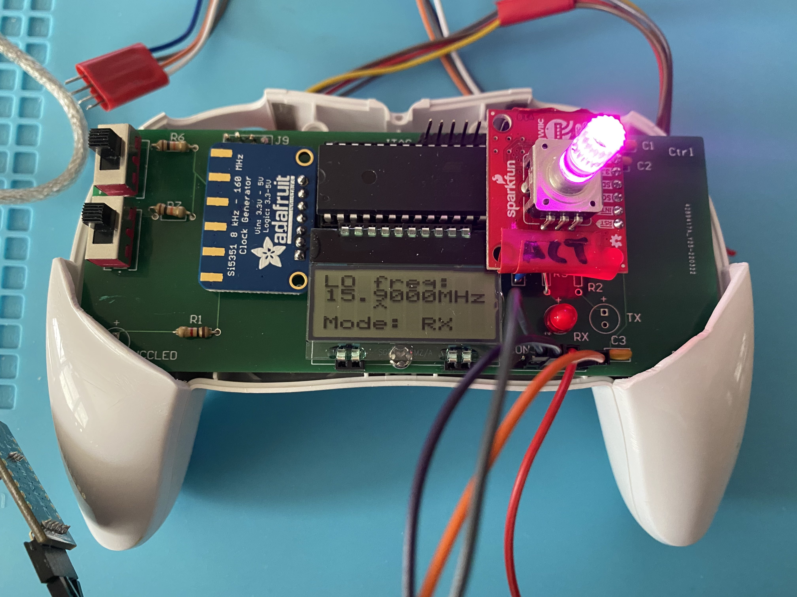

# ECE295
##### Summary

Code involved in the software define radio control and app.

| Serial Terminal Settings |      |
| ------------------------ | ---- |
| number of bits           | 8    |
| stop bits                | 2    |
| baud rate                | 2400 |
| parity                   | none |

</img>

</img>

